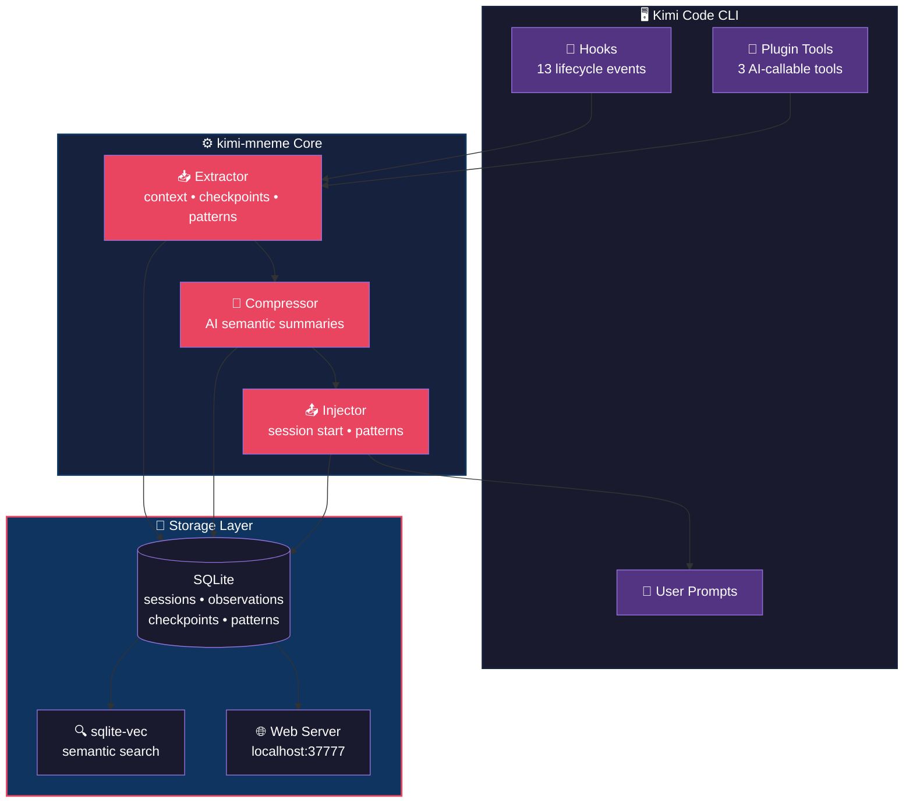

# kimi-mneme — Persistent Memory Plugin for Kimi Code CLI

[](https://pypi.org/project/kimi-mneme/)
[](https://www.python.org/)
[](LICENSE)
[](https://moonshotai.github.io/kimi-cli/)

**Version:** <!-- VERSION -->2.0.7<!-- /VERSION -->

> **Mneme** (Greek: Μνήμη) — the goddess of memory and the mother of the Muses.  
> This project brings persistent, AI-compressed memory to [Kimi Code CLI](https://moonshotai.github.io/kimi-cli/).

**🏷️ Tags:** `kimi-plugin` `kimi-cli-plugin` `kimi-plugins` `persistent-memory` `ai-memory` `coding-assistant`

---

## What is kimi-mneme?

**kimi-mneme** is a [Kimi Code CLI](https://moonshotai.github.io/kimi-cli/) plugin that adds persistent memory to your coding sessions. It automatically captures context, compresses it with AI, and injects relevant past observations into future sessions. Never lose track of what you were doing — even after days or weeks.

> 💡 **Looking for Kimi plugins?** This is an official-style plugin for the Kimi CLI ecosystem. Install with `uv tool install kimi-mneme` and run `mneme bootstrap` to get started.

### Why kimi-mneme?

- **Never lose context** — Your coding history survives across sessions, restarts, and even weeks of inactivity
- **AI-powered memory** — Automatically structures raw tool outputs into searchable observations
- **Zero configuration** — Works out of the box with Kimi Code CLI
- **Privacy-first** — Local SQLite storage; AI structuring/compression are optional and can be disabled
- **Cross-platform** — Windows, macOS, Linux support

### Offline Behavior & Privacy

kimi-mneme is designed to work **fully offline** with graceful degradation when AI services are unavailable:

| Feature | With API (online) | Without API (offline) |
|---------|-------------------|----------------------|
| **Observation storage** | ✅ Full | ✅ Full (always local) |
| **Full-text search (FTS5)** | ✅ Full | ✅ Full (local SQLite) |
| **Semantic search (sqlite-vec)** | ✅ Full | ✅ Full (local embeddings) |
| **Session timeline** | ✅ Full | ✅ Full |
| **Context injection** | ✅ Full | ✅ Full (heuristic-based) |
| **AI structuring** | ✅ Rich metadata (type, facts, concepts) | ⚠️ Heuristic fallback (rule-based) |
| **AI compression** | ✅ Semantic summaries | ⚠️ Raw observations stored |
| **Pattern detection** | ✅ AI + heuristic | ⚠️ Heuristic only |
| **Web viewer** | ✅ Full | ✅ Full |
| **MCP tools** | ✅ Full | ✅ Full |

> **Privacy note:** When AI structuring is enabled, tool outputs are sent to the Moonshot API **after** applying 3-layer sanitization (system content stripped, secrets redacted, privacy tags removed). No raw credentials, tokens, or `<private>` blocks ever leave your machine. To keep everything 100% local, disable AI structuring in config.

### Who is this for?

- Developers using [Kimi Code CLI](https://moonshotai.github.io/kimi-cli/) who want persistent project memory
- Teams working on complex codebases across multiple sessions
- Anyone looking for `kimi plugins` to extend their CLI workflow
- Users of [Moonshot AI](https://moonshot.ai/) ecosystem tools

### Key Features

| Feature | Description |
|---------|-------------|
| 🧠 **Persistent Memory** | Context survives across sessions, restarts, and reboots |
| 🤖 **AI Structuring** | Raw tool outputs → structured observations (title, facts, narrative, concepts) via Kimi API |
| ⚡ **Heuristic Fallback** | Works without API key — rule-based structuring when Kimi is unavailable |
| 🔍 **Smart Search** | Full-text (FTS5) + semantic (sqlite-vec) hybrid search across your project history |
| 📊 **Progressive Disclosure** | 3-layer retrieval: index → timeline → full details (token-efficient) |
| 🖥️ **Web Viewer** | Real-time memory stream at `http://localhost:37777` |
| 🔌 **Kimi Plugin Tools** | `mneme_search`, `mneme_timeline`, `mneme_get` — AI can query its own memory |
| 🖇️ **MCP Server** | Claude Desktop, Cursor, Goose integration — 15 memory tools |
| 📝 **PROJECT.md** | Auto-generated project context from structured observations |
| 🔒 **Privacy Tags** | 3-layer filtering: strip system content → redact sensitive → deep sanitize (applied before any AI processing) |
| 📊 **Knowledge Collections** | Curate and query project-specific knowledge corpora |
| 🌳 **Tree-sitter Analyzer** | AST-based code exploration (Python, JS, TS, Rust, Go) |
| 💰 **Token Economics** | See token savings and read cost per observation |
| ⚡ **Zero Config** | Install and forget — works automatically |
| 📁 **Project Config** | Per-project `.mneme.json` for custom settings |
| 📌 **Session Checkpoints** | Resume context after Kimi CLI compaction |
| 🔁 **Cross-Session Patterns** | Auto-detect recurring errors, fixes, decisions |
| ✂️ **Truncation Tracking** | Record when tool outputs exceed 100K chars |

---

## Quick Start

### Prerequisites

- **sqlite3 CLI**: Required for database inspection and internal operations. Install via your system package manager (`apt install sqlite3`, `brew install sqlite3`, `winget install SQLite.SQLite`, etc.)

### Install via `uv tool` (recommended — permanent install)

```bash
# Install as a permanent tool
uv tool install git+https://github.com/barrelc/kimi-mneme.git

# Run bootstrap (sets up hooks, plugin, DB, server)
mneme bootstrap

# Start using Kimi CLI
kimi
```

**Why `uv tool` instead of `uvx`?**
- No cache issues — installed permanently, not temporary
- Faster startup — no re-installation on each run
- Easy updates — `uv tool upgrade kimi-mneme`
- Commands always available: `mneme stats`, `mneme server`, etc.

### Update

```bash
# Update to latest version
uv tool upgrade kimi-mneme

# Re-run bootstrap to update hooks and config
mneme bootstrap
```

### Alternative: Install via `uvx` (temporary, no install)

```bash
# One-shot run (slower, re-installs each time)
uvx --refresh --from git+https://github.com/barrelc/kimi-mneme.git mneme bootstrap
```

> ⚠️ `uvx` caches installations. Use `--refresh` to force update, or switch to `uv tool install` for a better experience.

### Install via pip

```bash
pip install kimi-mneme
mneme bootstrap
```

### What `bootstrap` does

- Registers hooks in `~/.kimi/config.toml`
- Installs the Kimi CLI plugin
- Creates the SQLite database at `~/.kimi/mneme/mneme.db`
- Starts the web server on `http://localhost:37777`

> **Recommended:** Install `sqlite3` CLI for database inspection and internal operations:
> ```bash
> # Linux (Debian/Ubuntu)
> apt install sqlite3
>
> # macOS
> brew install sqlite3
>
> # Windows
> winget install SQLite.SQLite
> ```

### Use Kimi CLI normally

```bash
kimi
```

That's it. Every session is automatically captured and indexed. When you start a new session in a project, previous context is automatically injected.

---

## 🧩 Kimi Plugin Ecosystem

**kimi-mneme** is part of the growing [Kimi Code CLI](https://moonshotai.github.io/kimi-cli/) plugin ecosystem. Looking for more `kimi plugins`? This plugin extends Kimi CLI with:

- **Persistent Memory** — context survives across sessions
- **AI Tools** — `mneme_search`, `mneme_timeline`, `mneme_get` callable by Kimi AI
- **Web Dashboard** — real-time memory viewer at `localhost:37777`
- **MCP Server** — integrate with Claude Desktop, Cursor, Goose

> 🔍 **Search terms:** `kimi plugin`, `kimi cli plugin`, `kimi plugins`, `kimi memory`, `kimi persistent memory`, `moonshot ai plugin`

### Search your memory

From within Kimi CLI, the AI can search:

```
> Search my memory for the auth bug we fixed last week
```

Or use the web viewer:

```bash
open http://localhost:37777
```

---

## Architecture Overview



### Components

| Component | Purpose |
|-----------|---------|
| **Hooks** | 13 lifecycle event handlers (SessionStart, PostToolUse, SessionEnd, PostCompact, etc.) |
| **Plugin** | 3 AI-callable tools: `mneme_search`, `mneme_timeline`, `mneme_get` |
| **Extractor** | Parses observations, detects truncation, creates checkpoints, detects patterns |
| **Compressor** | Generates semantic summaries via Kimi API (reuses OAuth token) |
| **Injector** | Injects checkpoints, patterns, and relevant past context at session start |
| **SQLite** | Stores sessions, observations, summaries, checkpoints, patterns, compaction events |
| **sqlite-vec** | SQLite extension for semantic similarity search (primary, cross-platform) |
| **Chroma** | Vector database for semantic similarity search (legacy fallback, Linux/Mac only) |
| **Web Server** | FastAPI-based API on port 37777 — real-time SSE event stream |

---

## CLI Commands

```bash
mneme bootstrap          # One-shot setup (hooks, plugin, DB, server)
mneme update             # Update hooks and config to latest version
mneme server             # Start web server
mneme init               # Initialize database only
mneme stats              # Show database statistics
mneme cleanup --days 30  # Remove old observations
```

---

## Per-Project Configuration

Create `.mneme.json` in your project root:

```json
{
  "injection": {
    "max_tokens": 1000,
    "recency_boost_days": 14,
    "include_patterns": true
  },
  "privacy": {
    "exclude_patterns": ["*.local.env", "secrets/"]
  }
}
```

This merges with global config (project values override global).

---

## Documentation

- [Installation Guide](docs/INSTALL.md) — Detailed setup and configuration
- [Architecture](docs/ARCHITECTURE.md) — Deep dive into system design
- [Hooks Reference](docs/HOOKS.md) — All 13 lifecycle events explained
- [Plugin Tools](docs/TOOLS.md) — How AI queries memory
- [Web UI](docs/WEB_UI.md) — Using the memory viewer
- [Configuration](docs/CONFIG.md) — Settings and environment variables
- [Privacy](docs/PRIVACY.md) — Excluding sensitive data
- [Development](docs/DEVELOPMENT.md) — Contributing and hacking

---

## Requirements

- **Python**: 3.10+
- **Kimi Code CLI**: 1.41+
- **sqlite3 CLI**: Required for database inspection and internal operations. Install via your system package manager (`apt install sqlite3`, `brew install sqlite3`, `winget install SQLite.SQLite`, etc.)
- **OS**: Windows, macOS, Linux
- **Optional**: No API key needed — reuses Kimi CLI OAuth token. AI structuring/compression gracefully degrade to heuristic mode when offline

---

## License

[GNU Affero General Public License v3.0 (AGPL-3.0)](LICENSE)

Copyright (C) 2026 kimi-mneme contributors.

This project is free software: you can redistribute it and/or modify
it under the terms of the GNU Affero General Public License as published by
the Free Software Foundation, either version 3 of the License, or
(at your option) any later version.

---

## Acknowledgments

Inspired by the concept of persistent AI memory. Built for the Kimi CLI ecosystem with love for open-source tooling.

> *"Memory is the scribe of the soul."* — Aristotle
